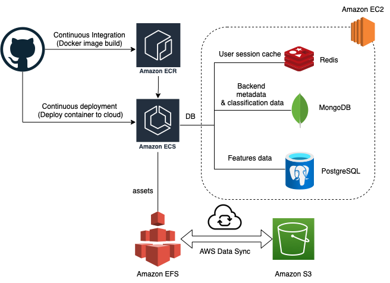

# MAPHIS-API-Backend

The backend code is deployed using a GitHub workflow to AWS Elastic Container Service (ECS). The docker images are built and pushed to the Elastic Container Registry (ECR). Tile images are stored on an Elastic File System (EFS), which is similar to a Network File System (NFS). Amazon Data Sync is used to sync the data between EFS and S3, for backup purposes.  

Note: All the backend code (ECS) is hosted in the AWS London region (eu-west-2) along with the EFS and data backup in S3. The frontend and the databases (redis, mongo, postgressql) are all setup in the North Virginia region.

Redis DB and Mongo DB are hosted on the same EC2 instance, `MetaDBInstance`. PostgreSQL is setup in a different EC2 instance with the name `postgresql-server`

Follow the steps on this link to setup a postgresql server on an ubuntu machine - https://www.digitalocean.com/community/tutorials/how-to-install-postgresql-on-ubuntu-20-04-quickstart

Follow the steps on this link to setup a PostGIS extension on the PostgreSQL server - https://computingforgeeks.com/how-to-install-postgis-on-ubuntu-linux/

Follow the steps on this document to setup a Redis DB server on a linux machine - https://redis.io/docs/getting-started/installation/install-redis-on-linux/

Follow the steps on this document MongoDB 4.4 on an Ubuntu machine - https://www.mongodb.com/docs/v4.4/tutorial/install-mongodb-on-ubuntu/

## Continuous Integrtion and Continuous Deployment workflow steps:
1) Build docker image
2) Login to AWS ECR
3) Build and push the docker image, using the Dockerfile in this repository.
4) Update the ECS task definition with the new image id
5) Stop the existing task definition.
6) Deploy the newly configured task definition.

For more information on the ECS architecture, check this link: https://docs.aws.amazon.com/AmazonECS/latest/developerguide/application_architecture.html

For more information on how to create and configure an ECS cluster, check this link: https://docs.aws.amazon.com/AmazonECS/latest/developerguide/clusters.html

For more information on how to create and configure an ECS task definition, check this link: https://docs.aws.amazon.com/AmazonECS/latest/developerguide/task_definitions.html

Check this link to get view the swagger documentation for the MAPHIS APIs - http://13.40.112.22/docs
